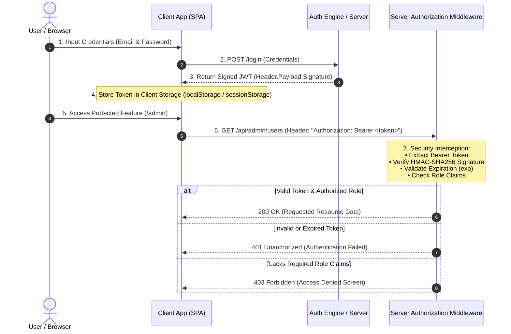

# 🛡️ JWT Authentication & Role-Based Access Control (RBAC) Security Lab

[]()
[]()
[]()

A comprehensive, interactive web application and security laboratory demonstrating stateless **JSON Web Token (JWT)** authentication, cryptographic signature integrity verification, and **Role-Based Access Control (RBAC)** protected route guards.

---

## 📋 Course Outcomes (CO) & Bloom's Taxonomy Mappings

| Course Outcome | Description | Bloom's Taxonomy Level |
| :--- | :--- | :--- |
| **CO1** | Understand web authentication & authorization paradigms | **BT1 (Remembering & Understanding)** |
| **CO2** | Implement stateless token-based sessions & RBAC permission models | **BT2 (Applying & Analyzing)** |
| **CO3** | Secure route guards, validate cryptographic signatures, and manage client storage | **BT3 (Evaluating & Implementing)** |

---

## 🎯 Key Objectives & Core Learning Outcomes

1. **Stateless Authentication Architecture**: Understand how JWTs replace traditional server-side session stores in distributed, scalable web systems.
2. **Cryptographic Token Verification**: Analyze Base64URL encoding vs. encryption, inspect token claims, and verify HMAC-SHA256 digital signatures to detect payload tampering.
3. **Granular RBAC Authorization**: Enforce role-based access control across distinct user tiers (**Admin**, **Editor**, **Viewer**, **Guest**) with dynamic UI element rendering and route interception.
4. **Secure Token Storage Management**: Evaluate client-side token storage strategies (`localStorage`, `sessionStorage`, and `In-Memory State`).
5. **HTTP Authorization Interceptors**: Visualize how client-side applications attach `Authorization: Bearer <token>` HTTP headers for server middleware validation.

## 🏗️ Conceptual Architecture & Authentication Flow



---

## 🌟 Highlighted Features

### 🔑 1. Interactive JWT Debugger & Inspector
- **3-Part Structure Breakdown**: Visual color-coded decomposition:
  - **Header** (Pink `#e11d48`): Signing algorithm (`HS256`) and token type (`JWT`).
  - **Payload** (Purple `#9333ea`): Claims (`sub`, `name`, `email`, `role`, `permissions`, `iat`, `exp`).
  - **Signature** (Cyan `#0284c7`): Cryptographic HMAC-SHA256 signature hash.
- **Payload Tampering Simulator**: Test altering token claims (e.g. escalating role from `Viewer` to `Admin` in the browser) without updating the secret key signature. Demonstrates how cryptographic signature verification detects tampering and rejects unauthorized access.
- **Real-Time Expiration Countdown**: Live TTL timer tracking token validity seconds.

### 🛡️ 2. Role-Based Access Control (RBAC) & Protected Route Guards
- **User Tiers**:
  - 👑 **Admin** (`admin@system.io`): Full administrative rights (`read`, `create`, `edit`, `delete`, `manage:users`, `view:audit_logs`).
  - ✍️ **Editor** (`editor@system.io`): Content creation & modification rights (`read`, `create`, `edit`).
  - 👁️ **Viewer** (`viewer@system.io`): Read-only privileges (`read`).
  - 🔒 **Guest**: Unauthenticated user state.
- **Protected Route Guards**: Routes like `/admin` (Admin Security Console) and `/audit-logs` (System Audit Logs) intercept unauthorized users and trigger a styled **403 Access Denied** screen.
- **Dynamic UI Rendering**: Action buttons (**Create**, **Edit**, **Delete**) in the Content Studio dynamically enable or lock based on active token claims (e.g., **Delete** is exclusively unlocked for Admin).

### 📡 3. HTTP Interceptor Console
- Simulates client API requests adding `Authorization: Bearer <token>` headers.
- Evaluates server response codes (`200 OK`, `401 Unauthorized`, `403 Forbidden`).

### 💾 4. Local Storage State Persistence
- All created, edited, or deleted content articles and security audit logs automatically persist in `localStorage` across page reloads. Includes a **"Reset Articles"** button to restore initial lab defaults at any time.

### 🎨 5. Clean Light Design System
- Crisp, professional slate theme (`#f8fafc` background, `#ffffff` cards, `#0f172a` typography) with **zero glow shadows** and flat 1px solid borders.

---

## 🚀 Quickstart & Local Development

No heavy build tools or Node.js runtime required! The application runs natively in any modern browser.

### Using Python HTTP Server:
```bash
python -m http.server 8080
```

### Using Node `serve` or Live Server:
```bash
npx serve .
```

Open `http://localhost:8080` in your web browser.
